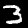
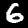
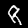

# MNIST GAN

This project implements a Generative Adversarial Network which generates images looking similar to MNIST pictures. 

# Approach

See ```mnist_gan.ipynb``` for more details.

## How to run this code
Simply run the [jupyter](http://jupyter.org) notebook ```mnist_gan.ipynb```. 

## Results
### Positive Results
The generated images looked mostly very realistic! Some hand-picked samples are shown below:  

  
  
  
  
  
  
  
  
  
  

### Negative Results
Sometimes, however, the GAN was unable to produce realistic looking numbers. Shown below are some 'failures'. Most images resemble a number but are either distorted or are missing a key feature of a number (e.g. the horizontal line of a 2).


  
  
  

